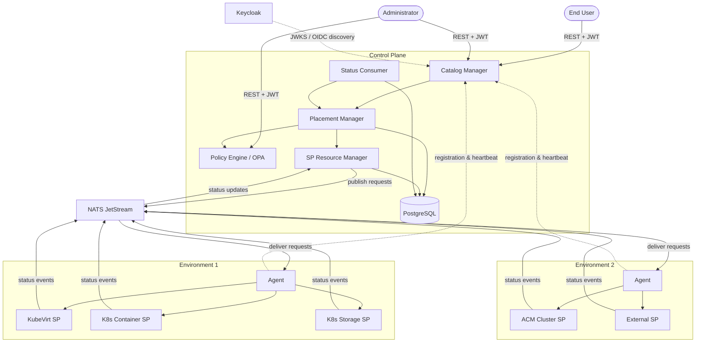
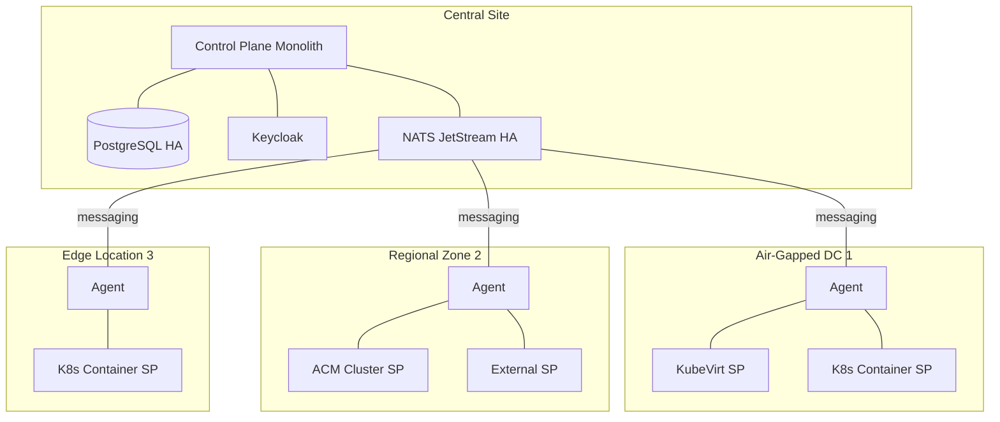
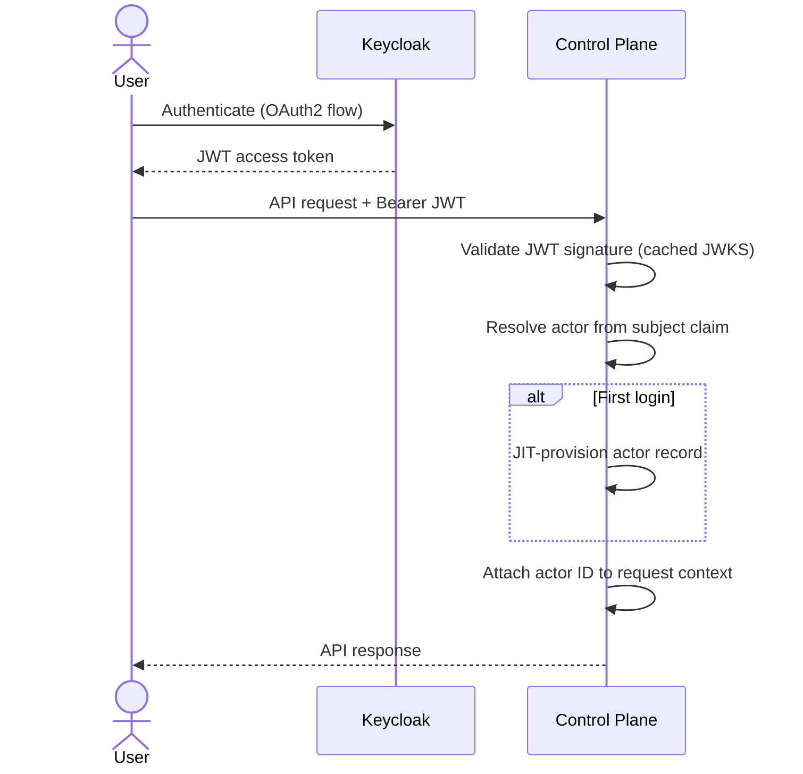
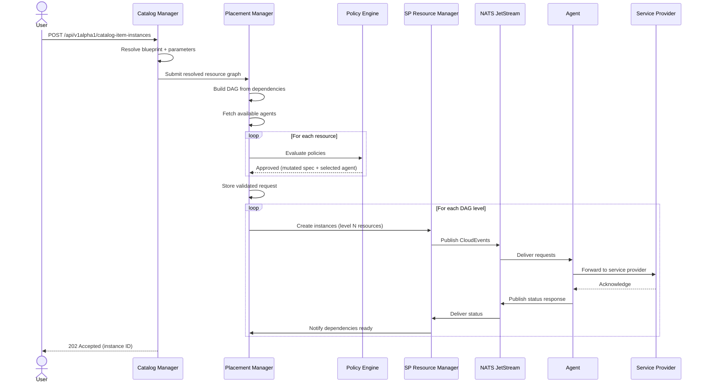
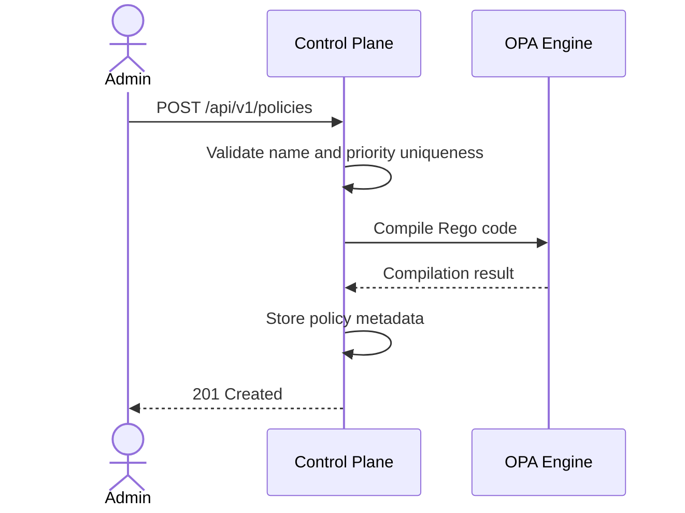
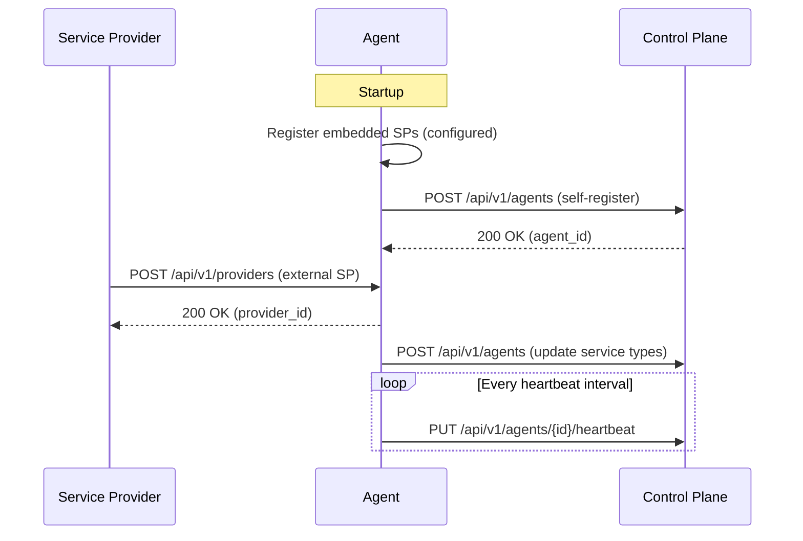
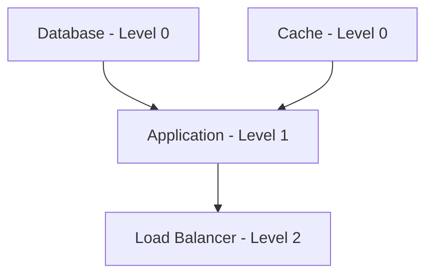

# DCM Architecture

## Open Questions

1. How will multi-region federation work when multiple control planes need to
   coordinate across geographically distributed sites?
2. What is the long-term tenant isolation model — shared database with row-level
   security, or separate schemas per tenant?

## Summary

This enhancement provides a high-level architectural overview of the Data Center
Manager (DCM) platform. It describes the core components, their
responsibilities, communication patterns, deployment topology, and the primary
user flows for both end-users and administrators. The document serves as an
architectural map that complements the detailed per-component enhancements.

## Motivation

DCM is a multi-component distributed system spanning a central control plane,
remote environment agents, and pluggable service providers. Understanding how
these pieces fit together requires reading many individual enhancements. A
single architecture document gives new contributors, operators, and reviewers a
starting point to understand the system holistically before diving into
component-specific details.

### Goals

- Document the responsibilities of every core DCM component and how they
  interact
- Illustrate synchronous (REST) and asynchronous (NATS) communication patterns
- Describe the deployment topology: control plane, environment agents, and
  air-gapped environments
- Summarize the primary end-user and administrator flows at a level that
  connects the individual enhancement documents

### Non-Goals

- Replacing per-component enhancements — detailed API contracts, data models,
  and policy semantics remain in their respective documents
- Specifying implementation-level details such as function signatures, package
  structure, or ORM schemas
- Defining operational runbooks or monitoring dashboards

## Proposal

### Component Overview

DCM is composed of the following core components:

| Component           | Responsibility                                                                                       |
| ------------------- | ---------------------------------------------------------------------------------------------------- |
| Catalog Manager     | Entry point for user requests; manages CatalogItems and CatalogItemInstances                         |
| Placement Manager   | Orchestrates resource provisioning; builds DAG, coordinates policy evaluation and agent selection    |
| Policy Engine       | Validates, mutates, and selects agents via Rego policies evaluated by an embedded OPA engine         |
| SP Resource Manager | Intermediary between Placement Manager and agents; publishes CloudEvents and consumes responses      |
| Status Consumer     | Monitors instance status in the database; notifies Placement Manager when dependencies become Ready  |
| Environment Agent   | Runs in each target environment; routes requests to service providers and reports health to DCM      |
| Service Providers   | Execute actual infrastructure provisioning (KubeVirt, K8s Container, K8s Storage, ACM Cluster, etc.) |
| PostgreSQL Database | Shared persistence for catalog, placement, policy, and SPRM domains                                  |
| NATS JetStream      | Asynchronous messaging for creation/deletion requests and status responses                           |
| Keycloak            | External identity provider; issues JWT tokens consumed by DCM for authentication                     |

All control-plane components (Catalog Manager, Placement Manager, Policy Engine,
SP Resource Manager, and Status Consumer) run as a single unified process — the
control-plane monolith. Inter-domain calls within the monolith are in-process;
no HTTP traffic flows between these domains.

### System Architecture

### Communication Patterns

DCM uses two communication styles:

**Synchronous (REST/HTTP)**

- User and admin requests to the control plane API
- Agent registration and heartbeats to the control plane
- External service provider registration to the agent
- Policy evaluation calls within the control plane (in-process)

**Asynchronous (NATS JetStream CloudEvents)**

- Creation and deletion requests from SPRM to agents
- Status responses from agents back to SPRM
- Health degradation warnings from agents
- Cancellation signals for re-routed requests

Each agent owns a set of NATS topics:

| Topic                       | Direction      | Purpose                                        |
| --------------------------- | -------------- | ---------------------------------------------- |
| `{agent_topic_name}`        | DCM → Agent    | Creation and deletion requests                 |
| `{agent_topic_name}.retry`  | Agent-internal | Requests held while an SP is unhealthy         |
| `{agent_topic_name}.cancel` | DCM → Agent    | Cancellation signals for re-routed requests    |
| `dcm.agents.responses`      | Agent → DCM    | Status acknowledgments, errors, queued notices |
| `dcm.agents.health`         | Agent → DCM    | SP health degradation warnings                 |

### Deployment Topology

DCM follows a hub-and-spoke model. The control plane runs centrally and
communicates with environment agents deployed in each target environment.
Environments may be air-gapped datacenters, regional zones, edge locations, or
ships.

**Deployment profiles:**

| Profile     | Control Plane Instances | PostgreSQL                       | NATS                 |
| ----------- | ----------------------- | -------------------------------- | -------------------- |
| Development | 1                       | Bundled (single)                 | Bundled (single)     |
| Production  | 2 or more (behind LB)   | HA (customer-managed or bundled) | HA JetStream cluster |

In production, multiple control-plane instances run behind a load balancer.
Background workers use leader election or database-backed job claiming to avoid
duplicate processing. JetStream consumers use durable semantics.

### Authentication and Authorization

DCM delegates identity management to Keycloak. All API requests carry a JWT
bearer token. The control plane validates the token locally using cached JWKS
keys obtained via OIDC discovery — no per-request call to Keycloak is needed.

Two Keycloak clients are configured:

- **dcm-proxy** — confidential client for the RHDH plugin and CI, using the
  client_credentials flow
- **dcm-cli** — public client for the CLI, using the Device Authorization Grant

A fallback mode accepts an `X-Forwarded-User` header validated against a shared
secret, supporting reverse-proxy deployments.

### End-User Flows

#### Requesting Infrastructure

An end user provisions infrastructure by submitting a CatalogItemInstance. The
system resolves the catalog blueprint, evaluates policies, and orchestrates
provisioning across one or more environments.

For multi-tier applications, the Placement Manager walks the DAG level by level.
Level-0 resources (those with no dependencies) are provisioned first. When they
reach the Ready state, the Status Consumer notifies the Placement Manager to
begin provisioning the next level. CEL expressions wire output values from
earlier resources into the specifications of later ones.

#### Viewing Resource Status

Users query the status of their provisioned resources through the Catalog
Manager API. The status reflects the aggregate state of all resources in the
DAG, updated asynchronously as agents report progress.

### Administrator Flows

#### Configuring Policies

Administrators create Rego policies that control validation, mutation, and agent
selection for all resource requests. Policies are organized in a three-level
hierarchy:

1. **Global** — set by super administrators, evaluated first
2. **Tenant** — set by tenant administrators
3. **User** — set by end users, evaluated last

Each policy specifies a label selector to match resource requests, a priority
within its level, and Rego code. The Policy Engine compiles the Rego via the
embedded OPA engine at creation time. During evaluation, policies run in order —
any rejection short-circuits the chain.

#### Managing the Service Catalog

Administrators define ServiceTypes (the kinds of resources DCM can provision)
and CatalogItems (blueprints that combine one or more ServiceTypes with
parameters and CEL expressions). End users then instantiate CatalogItems to
request infrastructure.

#### Agent and Service Provider Registration

Each environment agent self-registers with the control plane on startup,
advertising its environment name, supported service types, cost tier, and NATS
topic name. The agent sends periodic heartbeats that include consumer lag
metrics. The control plane uses this information for health-aware routing.

Service providers register with their local agent. Embedded providers (K8s
Container, KubeVirt, ACM Cluster) register automatically at startup. External
providers register via the agent REST API with lease-based renewal.

### Assumptions

- A NATS JetStream cluster is available and reachable from both the control
  plane and all environment agents
- A PostgreSQL database is available for the control plane
- A Keycloak instance is configured with the appropriate realm, clients, and
  user federation
- Network connectivity exists between the central site and each environment
  agent (directly or through a NATS leaf-node topology)

### User Stories

#### Story 1: End User Provisions a Multi-Tier Application

As an end user, I submit a CatalogItemInstance that references a multi-tier
blueprint (for example, a database plus an application container). The system
resolves the blueprint, evaluates policies, provisions the database first, and
once it is ready, provisions the application container with connection details
wired in via CEL expressions. I receive a single instance ID and can track the
aggregate status.

#### Story 2: Administrator Sets Up a New Environment

As an administrator, I deploy an environment agent in a new datacenter,
configure it with the appropriate embedded service providers, and start it. The
agent self-registers with the control plane, advertising its service types. I
then create policies that route certain workloads to this new environment based
on labels or cost tier. End users can now provision resources in the new
environment without any changes to their workflow.

#### Story 3: Administrator Configures a Governance Policy

As a tenant administrator, I create a Rego policy that restricts VM provisioning
to specific environments and enforces minimum resource limits. The policy is
evaluated for every matching request after global policies and before user-level
policies. Requests that violate the policy are rejected with a clear reason.

#### Story 4: End User Views Resource Status

As an end user, I query the status of my CatalogItemInstance and see the
aggregate state across all provisioned resources. I can see which resources are
ready, which are still provisioning, and whether any have failed.

### Implementation Details/Notes/Constraints

This enhancement is a documentation artifact. It does not introduce new code or
APIs. The architecture described here is already implemented across the
individual component enhancements referenced in the frontmatter. Readers should
consult the following enhancements for detailed specifications:

- **Control plane monolith** — unified process architecture and in-process
  domain calls
- **Control plane high availability** — HA deployment, leader election, durable
  consumers
- **Environment agent** — agent lifecycle, SP registration, health monitoring,
  request routing
- **Declarative API** — multi-tier application orchestration, DAG execution, CEL
  expressions
- **Authentication** — JWT validation, actor model, Keycloak integration
- **Placement manager** — resource admission, agent selection, timeout handling
- **Policy engine** — Rego policy hierarchy, evaluation chain, constraint
  accumulation
- **SP resource manager** — instance lifecycle, CloudEvent publishing,
  pending-request timeouts

### Risks and Mitigations

| Risk                                                                  | Mitigation                                                                                                          |
| --------------------------------------------------------------------- | ------------------------------------------------------------------------------------------------------------------- |
| Architecture document drifts from implementation as components evolve | Cross-reference individual enhancements via `see-also`; update this document when referenced enhancements change    |
| Single control-plane monolith is a single point of failure            | HA deployment profile runs multiple instances behind a load balancer with shared HA PostgreSQL and NATS             |
| NATS unavailability halts all asynchronous provisioning               | NATS JetStream persistence buffers messages; HA NATS cluster with multiple replicas                                 |
| Agent in air-gapped environment loses connectivity                    | Heartbeat-based health detection marks the agent unavailable; requests re-route to alternative agents               |
| Policy misconfiguration blocks all provisioning                       | Rego compilation at policy creation time catches syntax errors; priority and hierarchy prevent accidental overrides |

## Design Details

### DAG-Based Orchestration

Multi-tier applications are modeled as a directed acyclic graph (DAG) where
nodes are resources and edges are dependencies. The Placement Manager computes a
topological sort to assign each resource a level. Resources at the same level
may be provisioned in parallel. The Status Consumer watches for resources
reaching the Ready state and triggers the next level.

### Policy Evaluation Chain

Policies are evaluated as a chain-of-responsibility pipeline. Each policy
receives the current (possibly mutated) request specification, accumulated
constraints from prior policies, the currently selected agent, and the list of
available agents. Each policy may:

- Reject the request (short-circuits the chain)
- Mutate the request specification via patches
- Set constraints that restrict what subsequent policies can change
- Select or constrain agent selection

Constraints are cumulative — a lower-level policy cannot unlock fields locked by
a higher-level policy.

### Status Propagation

Status flows asynchronously from service providers back to the control plane:

1. The service provider reports status to its agent (in-process or via REST)
2. The agent publishes a CloudEvent to the `dcm.agents.responses` NATS topic
3. The SP Resource Manager consumes the event and updates the instance record in
   the database
4. The Status Consumer detects the state change and notifies the Placement
   Manager
5. The Placement Manager triggers the next DAG level if all dependencies are
   satisfied

### Upgrade / Downgrade Strategy

N/A — this enhancement is a documentation artifact and does not introduce
versioned APIs or data schemas.

## Implementation History

- 2026-07-22: Initial draft describing DCM architecture

## Drawbacks

Maintaining a high-level architecture document alongside detailed per-component
enhancements creates a risk of inconsistency. When a component enhancement
changes its API or behavior, this document may not be updated in the same pull
request, leading to stale information. This tradeoff is acceptable because the
document explicitly cross-references the authoritative component enhancements
and is intended as an entry point, not the source of truth for any single
component.

## Alternatives

### Alternative 1: Inline Architecture Sections in Each Component Enhancement

#### Description

Instead of a standalone architecture document, each component enhancement would
include a "System Context" section showing where that component fits in the
overall architecture.

#### Pros

- No separate document to maintain
- Architecture context is always co-located with the component it describes

#### Cons

- Readers must visit multiple documents to build a complete picture
- Redundant architecture diagrams across enhancements lead to inconsistency
- No single entry point for newcomers to understand the system

#### Status

Rejected

#### Rationale

The fragmentation cost outweighs the co-location benefit. New contributors and
reviewers need a single starting point to understand how DCM components
interact. Maintaining one architecture document with cross-references to
component enhancements is less error-prone than keeping parallel architecture
sections consistent across many documents.

## Infrastructure Needed

N/A — this enhancement is a documentation artifact and does not require new
repositories, CI/CD changes, or testing infrastructure.
