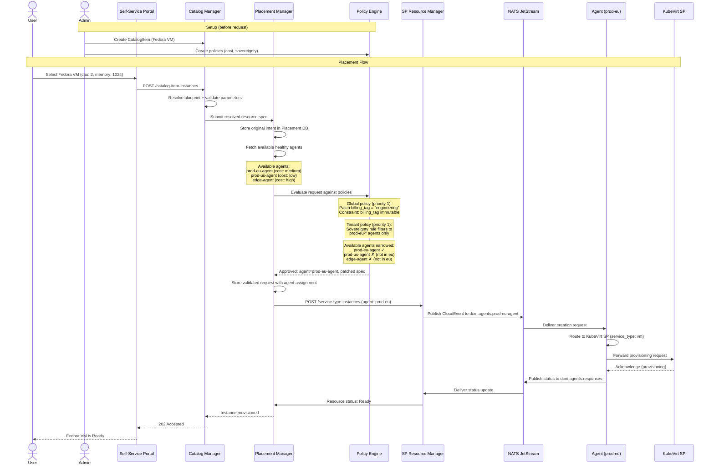
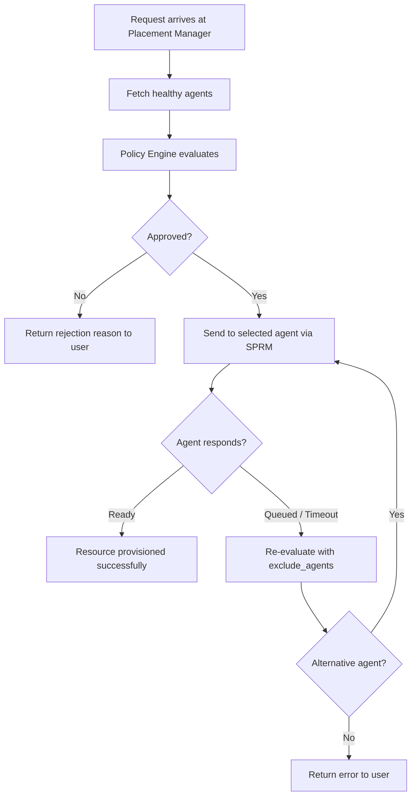

# Placement Flow

This document illustrates how DCM places a user's resource request onto a
specific environment and service provider.

## System Overview

```mermaid
graph TB
    User([User])
    Admin([Admin])

    subgraph Self-Service Portal
        CI["<b>Catalog Item</b><br/>Fedora VM<br/>+ cpu: 2<br/>+ memory: 1024"]
    end

    subgraph Control Plane
        CatMgr["<b>Catalog Manager</b><br/>Catalog Items: Fedora VM, Nginx Container<br/>Service Types: VM, Container, Database"]
        PM["<b>Placement Manager</b><br/>1. Store intent<br/>2. Fetch healthy agents<br/>3. Call Policy Engine<br/>4. Delegate to SPRM"]
        SPRM["<b>SP Resource Manager</b><br/>Publish CloudEvents<br/>to selected agent topic"]
    end

    subgraph Policy Engine
        direction TB
        GP["<b>Global Policies</b><br/><i>priority 1</i>"]
        TP["<b>Tenant Policies</b><br/><i>priority 2</i>"]
        UP["<b>User Policies</b><br/><i>priority 3</i>"]
        GP --> TP --> UP
    end

    subgraph Policy Examples
        P1["<b>Cost Efficiency Rule</b><br/>min&#40;agent.cost&#41;"]
        P2["<b>Sovereignty Rule</b><br/>user.region == eu<br/>→ prod-eu agents only"]
    end

    subgraph Available Agents
        direction TB
        A1["<b>prod-eu-agent</b><br/>environment: prod-eu-west-1<br/>cost: medium<br/>service_types: vm, container"]
        A2["<b>prod-us-agent</b><br/>environment: prod-us-east-1<br/>cost: low<br/>service_types: vm, database"]
        A3["<b>edge-agent</b><br/>environment: edge-site-3<br/>cost: high<br/>service_types: container"]
    end

    subgraph "Environment: prod-eu-west-1"
        AG1[Agent]
        KV["<b>KubeVirt SP</b><br/>cpu: required<br/>memory: required<br/>namespace: required"]
        KC["<b>K8s Container SP</b><br/>cpu: required<br/>memory: required<br/>namespace: required"]
    end

    subgraph "Environment: prod-us-east-1"
        AG2[Agent]
        VMW["<b>VMware SP</b><br/>cpu: required<br/>memory: required<br/>cluster: required"]
        PG["<b>PostgreSQL SP</b><br/>engine: required<br/>version: required<br/>replicas: required"]
    end

    NATS[NATS JetStream]

    User -->|"1. Request"| CI
    CI -->|"2. Submit instance"| CatMgr
    Admin -->|"Configure"| Policy Engine
    CatMgr -->|"3. Resolved spec"| PM
    PM -->|"4. Evaluate"| Policy Engine
    Policy Engine -->|"5. Selected agent + mutated spec"| PM
    PM -->|"6. Create instance"| SPRM
    SPRM -->|"7. Publish CloudEvent"| NATS
    NATS -->|"8. Deliver request"| AG1
    AG1 --> KV
    AG1 --> KC
    NATS -.->|"not selected"| AG2
    AG2 --> VMW
    AG2 --> PG

    Policy Examples -.-> Policy Engine
    Available Agents -.-> Policy Engine
```

## Placement Sequence



## Step-by-Step Explanation

1. **User requests a Fedora VM** from the self-service portal, specifying cpu: 2
   and memory: 1024.
2. **Catalog Manager** resolves the CatalogItem blueprint, validates the
   user-supplied parameters against the field schema, and submits the resolved
   resource specification to the Placement Manager.
3. **Placement Manager** stores the original intent in the Placement DB
   (enabling audit and rehydration), then fetches all healthy, non-congested
   agents that support the requested service type (vm).
4. **Policy Engine** evaluates the request through the policy chain:
   - **Global policy** patches the spec (e.g., adds `billing_tag`) and sets
     immutable constraints.
   - **Tenant policy** applies sovereignty rules, filtering agents to only those
     in the `prod-eu-*` environment.
   - **User policy** (if any) runs last but cannot override higher-level
     constraints.
   - Result: `prod-eu-agent` is selected, spec is mutated.
5. **Placement Manager** stores the validated, mutated request with the assigned
   agent name.
6. **SP Resource Manager** publishes a CloudEvent to the selected agent's NATS
   topic (`dcm.agents.prod-eu-agent`).
7. **Agent** in `prod-eu-west-1` receives the request, routes it to the KubeVirt
   SP (the registered provider for service type `vm`).
8. **KubeVirt SP** provisions the VM. Status flows back asynchronously: SP →
   Agent → NATS → SPRM → Placement Manager.

## Failure and Re-Routing

If the selected agent cannot fulfill the request (SP unhealthy, timeout
exceeded), the Placement Manager re-evaluates policies with
`exclude_agents: [failed_agent]` to find an alternative. If no alternative
exists, the request fails with an error returned to the user.


