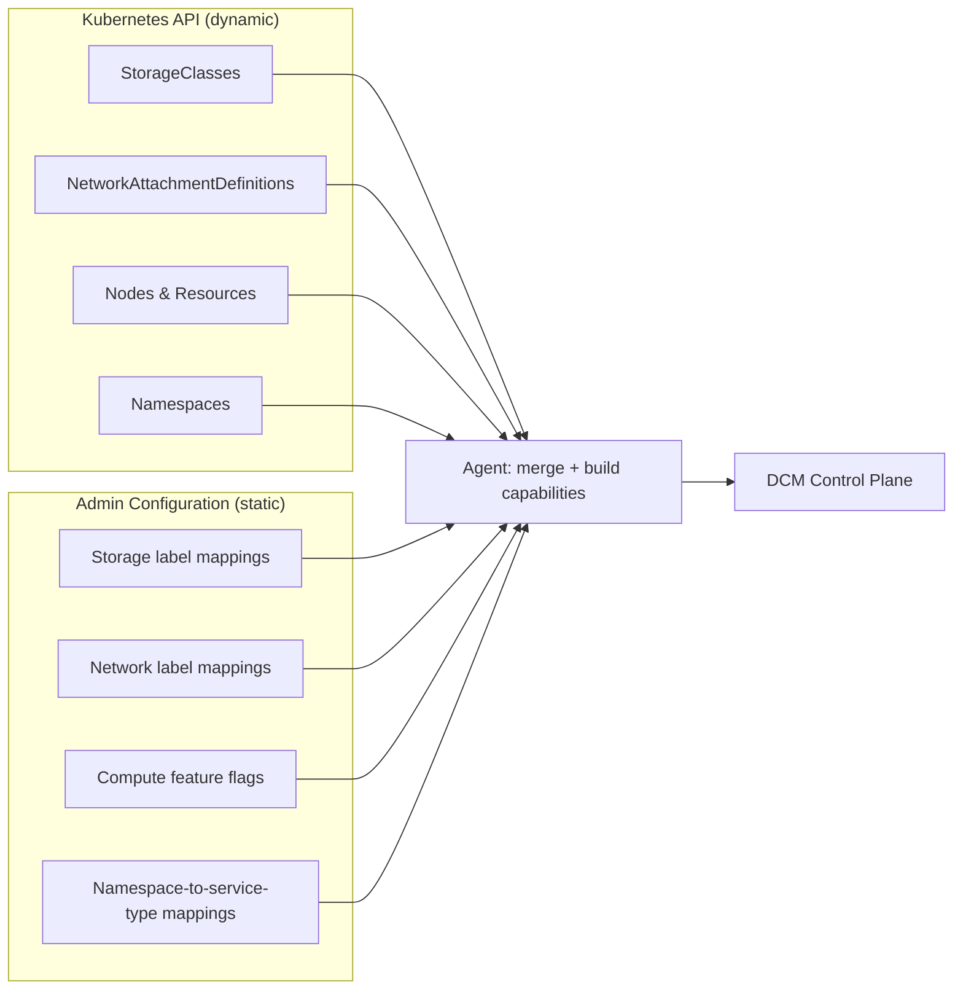
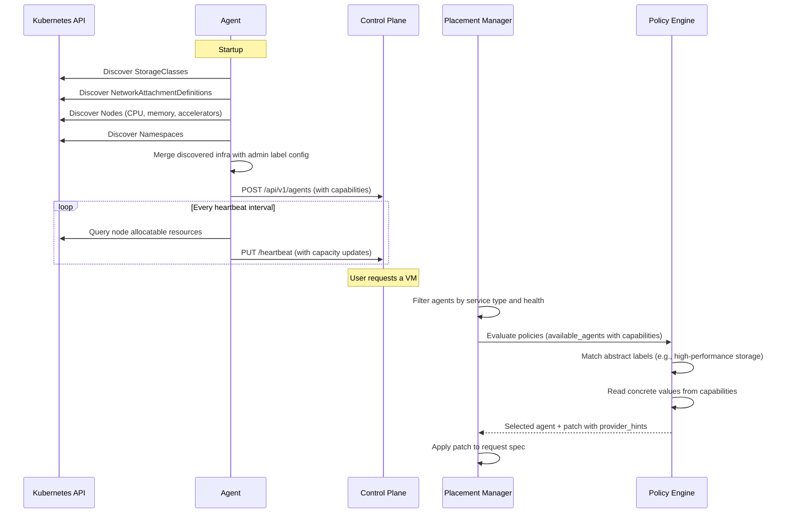

# Environment Capabilities

## Open Questions

1. Should the capability label taxonomy be an open vocabulary (any string) or a
   controlled vocabulary defined by DCM? An open vocabulary is more flexible but
   risks inconsistency across environments. A controlled vocabulary is easier to
   write policies against but requires governance.
2. How frequently should dynamic capacity values be refreshed — on every
   heartbeat, or on a separate longer interval to reduce load on the Kubernetes
   API?
3. Should capabilities be versioned so that policies can detect when an
   environment's capabilities change between evaluation and provisioning?

## Summary

This enhancement extends the environment agent registration and heartbeat
payloads to include structured capability data — storage tiers, networking
properties, compute features, and available namespaces. It also extends the
`available_agents` structure passed to the Policy Engine so that policies can
make informed placement decisions and inject the correct provider-specific
values (storage class, namespace, network) into the request.

## Motivation

Today, agents register with DCM reporting only their name, environment, service
types, aggregate resources, and cost tier. Policies must select an agent based
on these coarse signals alone. This creates a fundamental problem when different
environments offer different infrastructure capabilities:

- An OpenShift environment requires a **namespace** for every VM, but the user
  does not know (and should not need to know) which environment will be
  selected.
- One environment offers SSD-backed high-performance storage while another
  offers only standard HDD. A policy that routes latency-sensitive workloads has
  no way to distinguish them.
- Some environments provide tenant-isolated networking while others only offer
  shared pod networks. A sovereignty policy cannot enforce isolation without
  this information.
- A VMware environment needs a **cluster** name instead of a namespace. The
  policy needs to know which concrete values to inject for the selected
  environment.

Without capability data, policy writers are forced to hard-code environment
names into their Rego rules, which is brittle, error-prone, and breaks when
environments are added or reconfigured.

### Goals

- Define a capability data model that agents report alongside their existing
  registration data
- Expose capabilities in the `available_agents` array passed to the Policy
  Engine so that Rego policies can query them
- Support both abstract labels (for placement matching) and concrete values (for
  provider-specific value injection by policies)
- Use hybrid discovery: agents discover raw infrastructure from the Kubernetes
  API and administrators configure the label mappings
- Update dynamic values (capacity, health) on heartbeats while keeping static
  structure (tiers, features, mappings) on registration

### Non-Goals

- Defining a fixed taxonomy of capability labels — the initial implementation
  uses an open vocabulary; governance can be added later
- Auto-generating Rego policies from capabilities — policy authoring remains a
  manual process
- Changing the SP interface — service providers continue to receive the same
  request payloads; capabilities affect placement and policy, not SP contracts
- Reporting application-level metrics (response times, error rates) —
  capabilities describe infrastructure, not workload behavior

## Proposal

### Capability Data Model

The agent reports a `capabilities` object as part of its registration payload.
This object is organized into four domains: storage, networking, compute, and
namespaces.

#### Storage Capabilities

```json
{
  "storage": {
    "tiers": [
      {
        "label": "high-performance",
        "storage_class": "gp3-csi",
        "provisioner": "ebs.csi.aws.com",
        "type": "block",
        "features": ["encryption-at-rest", "snapshots", "resize"],
        "available_capacity": "500GB",
        "default": true
      },
      {
        "label": "standard",
        "storage_class": "gp2",
        "provisioner": "ebs.csi.aws.com",
        "type": "block",
        "features": ["snapshots"],
        "available_capacity": "2TB"
      },
      {
        "label": "shared-filesystem",
        "storage_class": "efs-sc",
        "provisioner": "efs.csi.aws.com",
        "type": "filesystem",
        "features": ["rwx"],
        "available_capacity": "10TB"
      }
    ]
  }
}
```

Each storage tier entry contains:

| Field                | Type     | Description                                                                   |
| -------------------- | -------- | ----------------------------------------------------------------------------- |
| `label`              | string   | Abstract label used by policies for matching                                  |
| `storage_class`      | string   | Concrete Kubernetes StorageClass name for injection                           |
| `provisioner`        | string   | CSI driver or provisioner name (discovered from K8s API)                      |
| `type`               | string   | `block` or `filesystem`                                                       |
| `features`           | string[] | Capability labels: `encryption-at-rest`, `snapshots`, `resize`, `rwx`, `rwop` |
| `available_capacity` | string   | Remaining allocatable capacity (dynamic, updated on heartbeat)                |
| `default`            | boolean  | Whether this is the default tier when no preference is specified              |

#### Networking Capabilities

```json
{
  "networking": {
    "profiles": [
      {
        "label": "shared",
        "type": "pod-network",
        "isolation": "shared",
        "connectivity": ["internal", "internet"],
        "features": ["ingress", "load-balancer", "network-policy"],
        "default": true
      },
      {
        "label": "tenant-isolated",
        "type": "multus",
        "network_attachment": "isolated-net",
        "isolation": "tenant-isolated",
        "connectivity": ["internal"],
        "features": ["network-policy"]
      },
      {
        "label": "high-performance",
        "type": "sriov",
        "network_attachment": "sriov-net-dp",
        "isolation": "shared",
        "connectivity": ["internal"],
        "features": ["sriov", "dpdk"]
      }
    ]
  }
}
```

Each networking profile entry contains:

| Field                | Type     | Description                                                                                         |
| -------------------- | -------- | --------------------------------------------------------------------------------------------------- |
| `label`              | string   | Abstract label used by policies for matching                                                        |
| `type`               | string   | Network type: `pod-network`, `multus`, `sriov`                                                      |
| `network_attachment` | string   | Concrete NetworkAttachmentDefinition name for injection (if applicable)                             |
| `isolation`          | string   | Isolation level: `shared`, `tenant-isolated`, `air-gapped`                                          |
| `connectivity`       | string[] | Connectivity options: `internet`, `internal`, `vpn`                                                 |
| `features`           | string[] | Capability labels: `ingress`, `load-balancer`, `network-policy`, `sriov`, `dpdk`, `gpu-passthrough` |
| `default`            | boolean  | Whether this is the default profile when no preference is specified                                 |

#### Compute Capabilities

```json
{
  "compute": {
    "architectures": ["amd64", "arm64"],
    "accelerators": [
      {
        "label": "gpu",
        "type": "nvidia-a100",
        "available_count": 4
      }
    ],
    "available_cpu": 200,
    "available_memory": "512GB",
    "features": ["nested-virtualization", "hugepages", "cpu-pinning"]
  }
}
```

| Field              | Type     | Description                                                                  |
| ------------------ | -------- | ---------------------------------------------------------------------------- |
| `architectures`    | string[] | Supported CPU architectures                                                  |
| `accelerators`     | object[] | Available hardware accelerators with label, type, and count                  |
| `available_cpu`    | integer  | Remaining allocatable vCPUs (dynamic, updated on heartbeat)                  |
| `available_memory` | string   | Remaining allocatable memory (dynamic, updated on heartbeat)                 |
| `features`         | string[] | Compute features: `nested-virtualization`, `hugepages`, `cpu-pinning`, `tpm` |

#### Namespace Capabilities

```json
{
  "namespaces": [
    {
      "name": "vm-workloads",
      "service_types": ["vm"],
      "labels": { "team": "platform" }
    },
    {
      "name": "app-workloads",
      "service_types": ["container"],
      "labels": {}
    },
    {
      "name": "tenant-alpha",
      "service_types": ["vm", "container", "storage"],
      "labels": { "tenant": "alpha" }
    }
  ]
}
```

| Field           | Type              | Description                                                  |
| --------------- | ----------------- | ------------------------------------------------------------ |
| `name`          | string            | Concrete Kubernetes namespace name for injection             |
| `service_types` | string[]          | Which service types may be provisioned in this namespace     |
| `labels`        | map[string]string | Labels for policy matching (tenant, team, environment, etc.) |

### Extended Agent Registration Payload

The `capabilities` object is added to the existing agent registration payload:

```json
{
  "name": "prod-eu-agent",
  "environment": "prod-eu-west-1",
  "service_types": ["vm", "container", "storage"],
  "resources_available": {
    "total_cpu": 200,
    "total_memory": "1TB",
    "total_storage": "2TB",
    "total_node": 100
  },
  "cost": "medium-low",
  "topic_name": "dcm.agents.prod-eu-agent",
  "capabilities": {
    "storage": { "tiers": [] },
    "networking": { "profiles": [] },
    "compute": {},
    "namespaces": []
  }
}
```

The `capabilities` field is optional for backward compatibility. Agents that do
not report capabilities continue to work as before — policies simply have no
capability data to query for those agents.

### Extended Heartbeat Payload

Dynamic values (capacity, accelerator counts) are updated on heartbeats. The
full capability structure is not resent — only the fields that change:

```json
{
  "timestamp": "2026-07-22T12:34:56Z",
  "consumer_lag": 42,
  "capacity": {
    "storage": {
      "high-performance": "450GB",
      "standard": "1.8TB",
      "shared-filesystem": "9.5TB"
    },
    "compute": {
      "available_cpu": 180,
      "available_memory": "480GB",
      "accelerators": {
        "gpu": 3
      }
    }
  }
}
```

The `capacity` field is optional. When present, DCM merges the updated values
into the agent's stored capabilities.

### Extended Policy Engine Input

The `available_agents` array passed to the Policy Engine is extended to include
capabilities:

```json
{
  "spec": {
    "service_type": "vm",
    "vcpu": { "count": 2 },
    "memory": { "size": "4GB" }
  },
  "available_agents": [
    {
      "name": "prod-eu-agent",
      "environment": "prod-eu-west-1",
      "service_types": ["vm", "container", "storage"],
      "cost": "medium-low",
      "capabilities": {
        "storage": {
          "tiers": [
            {
              "label": "high-performance",
              "storage_class": "gp3-csi",
              "type": "block",
              "features": ["encryption-at-rest", "snapshots"],
              "available_capacity": "450GB",
              "default": true
            }
          ]
        },
        "networking": {
          "profiles": [
            {
              "label": "tenant-isolated",
              "network_attachment": "isolated-net",
              "isolation": "tenant-isolated",
              "connectivity": ["internal"],
              "features": ["network-policy"],
              "default": false
            }
          ]
        },
        "compute": {
          "architectures": ["amd64"],
          "features": ["nested-virtualization"],
          "available_cpu": 180,
          "available_memory": "480GB"
        },
        "namespaces": [
          {
            "name": "vm-workloads",
            "service_types": ["vm"],
            "labels": {}
          }
        ]
      }
    }
  ],
  "agent": "",
  "constraints": {},
  "agent_constraints": {},
  "exclude_agents": []
}
```

### Hybrid Discovery Model

Agents discover raw infrastructure from the platform API and administrators
configure the label mappings. The two sources merge at the agent:



**What the agent discovers automatically:**

- Storage class names, provisioners, and type (from `StorageClass` resources)
- Network attachment definitions and their types (from
  `NetworkAttachmentDefinition` resources)
- Node architectures, CPU/memory capacity, accelerator devices (from `Node`
  resources)
- Namespace names and labels (from `Namespace` resources)
- Available capacity (aggregated from node allocatable minus requested, updated
  on heartbeat)

**What the administrator configures:**

- Label mappings: which storage class maps to which abstract tier (e.g.,
  `gp3-csi` is `high-performance`)
- Feature flags per tier and profile (e.g., `gp3-csi` supports
  `encryption-at-rest`)
- Network profile labels and isolation levels (e.g., `isolated-net` is
  `tenant-isolated`)
- Namespace-to-service-type assignments (e.g., `vm-workloads` is for `vm`
  resources)
- Compute feature flags (e.g., `nested-virtualization` is available)

Agent configuration example:

```yaml
capabilities:
  storage:
    mappings:
      - storage_class: gp3-csi
        label: high-performance
        features: [encryption-at-rest, snapshots, resize]
      - storage_class: gp2
        label: standard
        features: [snapshots]
      - storage_class: efs-sc
        label: shared-filesystem
        features: [rwx]
  networking:
    mappings:
      - network_attachment: ""
        label: shared
        type: pod-network
        isolation: shared
        connectivity: [internal, internet]
        features: [ingress, load-balancer, network-policy]
      - network_attachment: isolated-net
        label: tenant-isolated
        type: multus
        isolation: tenant-isolated
        connectivity: [internal]
        features: [network-policy]
  namespaces:
    - name: vm-workloads
      service_types: [vm]
    - name: app-workloads
      service_types: [container]
  compute:
    features: [nested-virtualization, hugepages]
```

The agent merges discovered infrastructure with admin-configured labels and
reports the combined result to DCM. If a storage class exists in Kubernetes but
has no label mapping configured, the agent ignores it (it is not advertised as a
capability).

### Policy Examples

#### Example 1: Route VM to Environment with Fast Encrypted Storage

A policy that ensures VMs with large disks land on environments with
high-performance encrypted storage and injects the correct storage class and
namespace:

```rego
package fast_storage_placement

import future.keywords.in

default rejected = false

# Find an agent with high-performance encrypted storage
selected_agent := agent.name {
    some agent in input.available_agents
    some tier in agent.capabilities.storage.tiers
    tier.label == "high-performance"
    "encryption-at-rest" in tier.features
}

# Inject the storage class and namespace for the selected agent
patch := {
    "provider_hints": {
        "kubevirt": {
            "storage_class": tier.storage_class,
            "namespace": ns.name
        }
    }
} {
    some agent in input.available_agents
    agent.name == selected_agent
    some tier in agent.capabilities.storage.tiers
    tier.label == "high-performance"
    some ns in agent.capabilities.namespaces
    "vm" in ns.service_types
}
```

#### Example 2: Enforce Tenant Network Isolation

A sovereignty policy that requires tenant workloads to use isolated networking:

```rego
package tenant_isolation

import future.keywords.in

# Reject agents that lack tenant-isolated networking
rejected {
    agent := input.available_agents[_]
    agent.name == input.agent
    not has_isolated_network(agent)
}

rejection_reason := "Selected environment does not support tenant-isolated networking"

has_isolated_network(agent) {
    some profile in agent.capabilities.networking.profiles
    profile.isolation == "tenant-isolated"
}

# Inject the network attachment for the selected agent
patch := {
    "provider_hints": {
        "kubevirt": {
            "network_attachment": profile.network_attachment
        }
    }
} {
    some agent in input.available_agents
    agent.name == input.agent
    some profile in agent.capabilities.networking.profiles
    profile.isolation == "tenant-isolated"
}
```

#### Example 3: GPU Workload Placement

A policy that routes GPU workloads to environments with available GPUs:

```rego
package gpu_placement

import future.keywords.in

default rejected = false

# Reject if no agent has available GPUs
rejected {
    count(gpu_agents) == 0
}

rejection_reason := "No environment with available GPUs found"

gpu_agents[agent.name] {
    some agent in input.available_agents
    some acc in agent.capabilities.compute.accelerators
    acc.label == "gpu"
    acc.available_count > 0
}

# Select the agent with the most available GPUs
selected_agent := name {
    name := max_by_gpu(gpu_agents)
}

max_by_gpu(agents) := name {
    name := [agent.name |
        some agent in input.available_agents
        agent.name in agents
    ][0]
}
```

#### Example 4: Capacity-Aware Placement

A policy that only routes to environments with enough available resources:

```rego
package capacity_check

import future.keywords.in

default rejected = false

# Reject if the selected agent lacks capacity
rejected {
    input.agent != ""
    some agent in input.available_agents
    agent.name == input.agent
    agent.capabilities.compute.available_cpu < input.spec.vcpu.count
}

rejection_reason := sprintf(
    "Agent %s has %d available CPUs but %d were requested",
    [input.agent,
     agent.capabilities.compute.available_cpu,
     input.spec.vcpu.count]
) {
    some agent in input.available_agents
    agent.name == input.agent
}
```

### Assumptions

- Agents have read access to the Kubernetes API for StorageClass,
  NetworkAttachmentDefinition, Node, and Namespace resources
- Administrators configure label mappings at agent deployment time via a
  configuration file or environment variables
- The Policy Engine passes the full `capabilities` object to OPA without
  filtering or transformation
- Capacity values are approximate — they may change between policy evaluation
  and actual provisioning

### User Stories

#### Story 1: Policy Writer Routes Workloads by Storage Tier

As a policy writer, I write a Rego policy that checks whether the requested
workload needs high-performance storage. If it does, the policy selects an agent
whose capabilities include a `high-performance` storage tier and injects the
corresponding storage class name into `provider_hints`. I do not need to know
the storage class names in each environment — I only match on the abstract
`high-performance` label and read the concrete `storage_class` value from the
capability data.

#### Story 2: Environment Admin Onboards a New Datacenter

As an environment administrator, I deploy an agent in a new datacenter,
configure the label mappings for its storage classes and networks, and start the
agent. The agent discovers the available StorageClasses and
NetworkAttachmentDefinitions from the Kubernetes API, merges them with my label
configuration, and registers the combined capabilities with DCM. Existing
policies immediately start routing workloads to this environment based on its
capabilities without any policy changes.

#### Story 3: Policy Writer Enforces Tenant Isolation

As a policy writer, I write a tenant-level policy that requires all workloads
for tenant "alpha" to use `tenant-isolated` networking. The policy checks that
the selected agent has a networking profile with `isolation: tenant-isolated`
and injects the concrete `network_attachment` name into `provider_hints`. If no
available agent supports tenant isolation, the request is rejected with a clear
reason.

#### Story 4: Platform Team Monitors Capacity

As a platform team member, I observe that an environment's available CPU and
storage capacity decreases on each heartbeat. When capacity drops below a
threshold, capacity-aware policies stop routing new workloads to that
environment, distributing load to other environments automatically.

### Implementation Details/Notes/Constraints

The `capabilities` field is additive — it extends the existing agent
registration payload without changing existing fields. Agents that do not report
capabilities continue to function. Policies that do not reference `capabilities`
are unaffected.

The Placement Manager already filters `available_agents` by service type and
health status before passing them to the Policy Engine. No additional filtering
based on capabilities is performed at the Placement Manager level — all
capability-based decisions are made by policies. This keeps the Placement
Manager simple and gives policy writers full control.

Dynamic capacity values are eventually consistent. Between heartbeats, the
stored capacity may not reflect the actual state. Policies should treat capacity
as a best-effort signal, not a guarantee. The SP remains responsible for
rejecting requests that exceed actual capacity at provisioning time.

### Risks and Mitigations

| Risk                                                                     | Mitigation                                                                                                                         |
| ------------------------------------------------------------------------ | ---------------------------------------------------------------------------------------------------------------------------------- |
| Capability data grows large and increases policy evaluation latency      | Limit capability reporting to configured (mapped) resources only; unmapped infrastructure is not advertised                        |
| Capacity values are stale between heartbeats, leading to over-scheduling | Policies treat capacity as best-effort; SPs validate actual capacity at provisioning time and return errors if insufficient        |
| Inconsistent label vocabulary across environments makes policies fragile | Document a recommended label vocabulary; enforce consistency via CI linting of agent configuration                                 |
| Admin forgets to configure label mappings for new storage classes        | Agent logs a warning for discovered but unmapped infrastructure; monitoring alerts on unmapped resources                           |
| Kubernetes API calls for discovery add load to the cluster               | Discovery runs on a configurable interval (default: 5 minutes), not on every heartbeat; capacity aggregation uses cached node data |

## Design Details

### Data Flow



### Capability Storage in DCM

DCM stores the full `capabilities` object in the agent registry alongside
existing agent fields. On registration, the full object is stored. On heartbeat,
only the `capacity` delta is merged into the stored object. The merged object is
passed to the Policy Engine as part of `available_agents`.

### Non-Kubernetes Environments

For non-Kubernetes environments (e.g., VMware), auto-discovery is not available.
The administrator configures capabilities entirely via static configuration. The
agent reports them as-is without merging with discovered infrastructure.

Example for a VMware environment:

```yaml
capabilities:
  storage:
    mappings:
      - label: high-performance
        storage_class: vsanDatastore-ssd
        type: block
        features: [snapshots, encryption-at-rest]
      - label: standard
        storage_class: nfsDatastore
        type: filesystem
        features: [snapshots]
  networking:
    mappings:
      - label: production
        type: distributed-switch
        network_attachment: dvs-production
        isolation: shared
        connectivity: [internal, internet]
        features: [load-balancer]
  compute:
    architectures: [amd64]
    features: [nested-virtualization, tpm]
    clusters:
      - name: cluster-01
        available_cpu: 500
        available_memory: "2TB"
```

The VMware SP receives `provider_hints` containing
`storage_class: vsanDatastore-ssd` or `cluster: cluster-01` and maps these to
the appropriate vSphere constructs.

### Upgrade / Downgrade Strategy

The `capabilities` field is optional in the agent registration payload. On
upgrade, existing agents continue to register without capabilities. Policies
that reference `capabilities` must handle the case where the field is absent
(standard Rego behavior — accessing a missing field yields `undefined`, which
evaluates to `false` in boolean context).

On downgrade, the control plane ignores the `capabilities` field if it does not
recognize it. Agents that report capabilities to an older control plane receive
no error — the field is silently dropped.

## Implementation History

- 2026-07-22: Initial draft proposing environment capability reporting

## Drawbacks

This enhancement adds complexity to the agent configuration and the policy
evaluation input. Environment administrators must now understand and configure
label mappings for storage classes, networks, and namespaces — work that was
previously unnecessary because providers used implicit defaults. For simple
deployments with a single environment and no policy-driven placement, this
overhead provides no benefit. The tradeoff is acceptable because
multi-environment deployments with policy-driven placement are the primary use
case for DCM, and those deployments cannot function correctly without capability
visibility.

## Alternatives

### Alternative 1: Resolution at the Agent or SP Level

#### Description

Instead of exposing concrete values in `available_agents` for policies to
inject, policies would only select the agent and set abstract intent labels
(e.g., `storage_tier: high-performance`). The agent or SP would then resolve the
abstract label to a concrete value (e.g., `storage_class: gp3-csi`) using its
local configuration.

#### Pros

- Policies are simpler — they only set intent, never concrete values
- Adding a new storage class only requires agent reconfiguration, not policy
  updates
- Cleaner separation of concerns: policies decide "what," agents decide "how"

#### Cons

- Policies lose visibility into what concrete values will be used, making
  debugging harder
- The agent must understand intent labels and resolve them, adding logic to the
  agent
- If multiple concrete values match an intent label, the agent must have
  selection logic that the policy writer cannot influence
- Harder to audit: the mapping from intent to concrete value is opaque to the
  control plane

#### Status

Rejected

#### Rationale

Policy-level resolution gives policy writers full control over both placement
and value injection in a single evaluation pass. Since policies already have
access to the concrete values via `available_agents`, there is no need for a
second resolution step at the agent. This avoids adding resolution logic to the
agent and keeps the agent's role simple: receive a fully-specified request and
forward it to the SP.

### Alternative 2: Flat Labels Instead of Structured Capabilities

#### Description

Instead of a structured capability model with domains (storage, networking,
compute), agents report a flat set of key-value labels (e.g.,
`storage.tier=high-performance`, `networking.isolation=tenant-isolated`).
Policies match on these labels directly.

#### Pros

- Simpler data model — no nested structure to navigate in Rego
- Easy to extend with new capability types without schema changes
- Familiar pattern from Kubernetes labels

#### Cons

- No way to associate a storage label with its concrete storage class name —
  policies cannot inject provider-specific values
- No capacity tracking — flat labels cannot represent numeric values that change
  over time
- Loses the ability to express "this environment has multiple storage tiers with
  different properties"
- Policy writers must invent ad-hoc conventions for label naming

#### Status

Rejected

#### Rationale

The primary value of capability reporting is enabling policies to both select an
environment and inject concrete provider-specific values. Flat labels support
selection but not injection, which leaves the namespace and storage class
problem unsolved. The structured model is more complex but directly addresses
the motivating use cases.

## Infrastructure Needed

N/A — this enhancement extends existing agent and control plane components and
does not require new repositories, CI/CD changes, or additional infrastructure.
