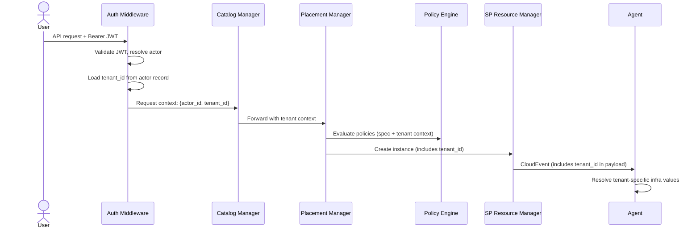
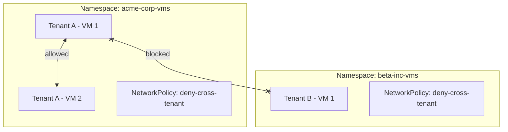
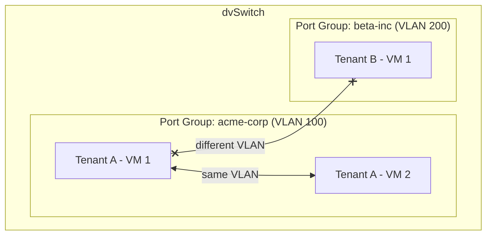
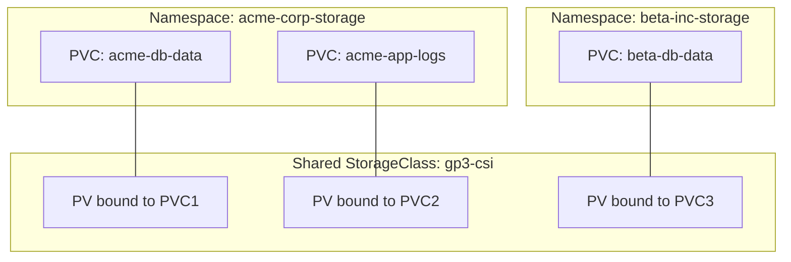
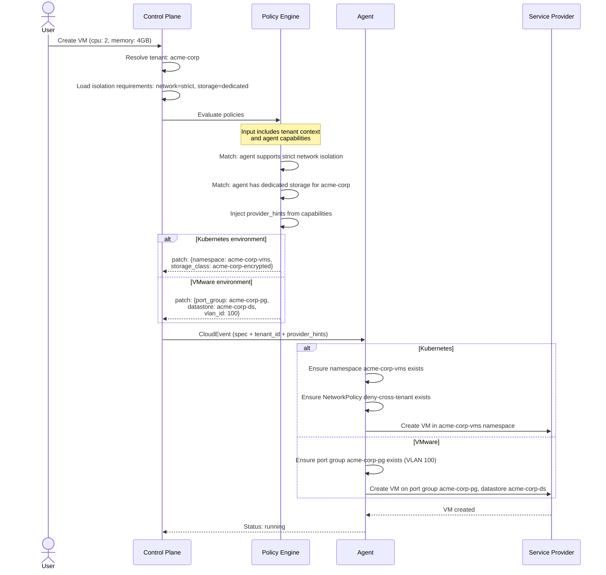
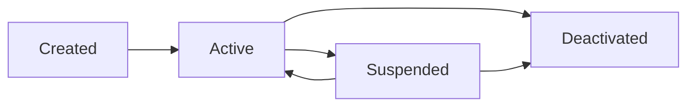
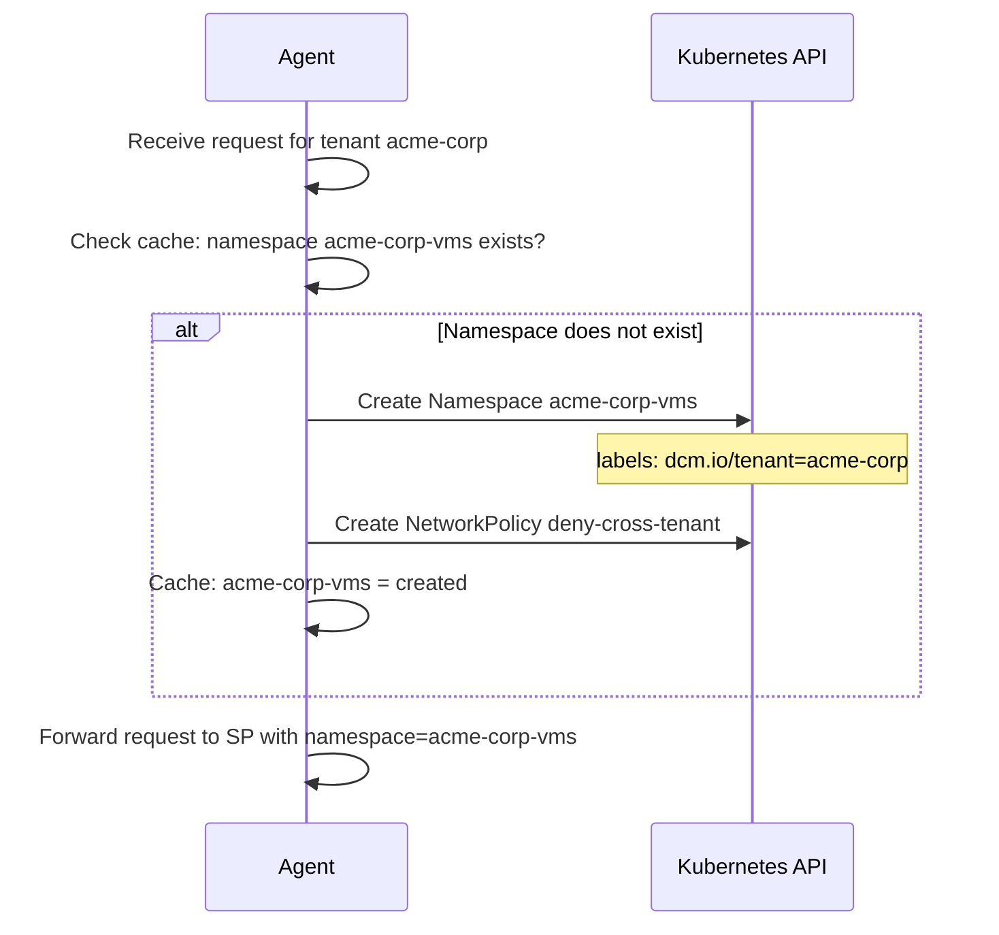
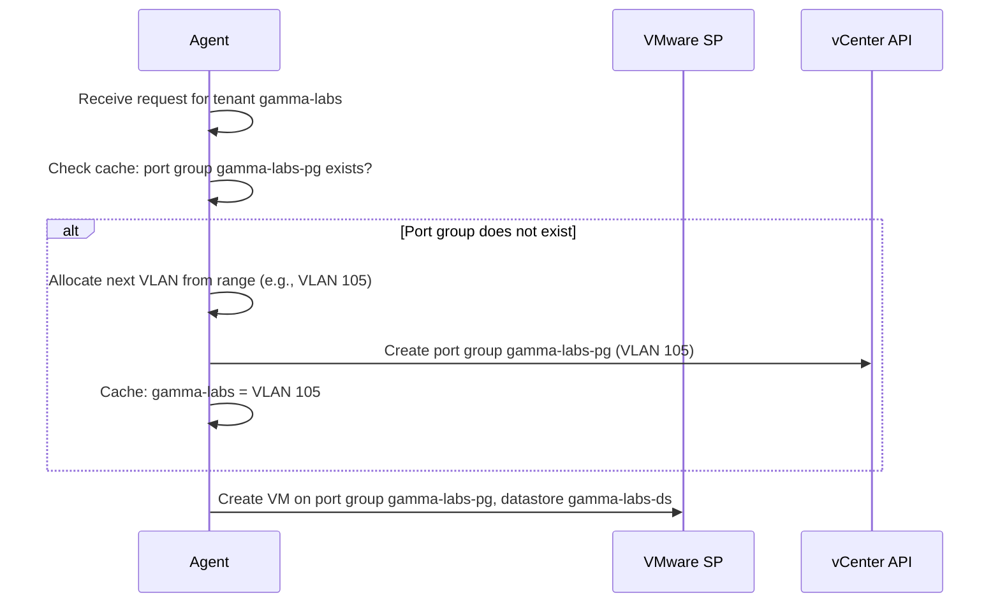

# Multi-Tenancy

## Open Questions

1. Should a user belong to exactly one tenant, or can a user be a member of
   multiple tenants and switch context?
2. How are tenants provisioned — self-service registration, or admin-only
   creation?
3. Should tenant quotas (max VMs, max storage, max CPU) be enforced at the
   control plane level, at the policy level, or both?
4. When a VMware environment runs out of available VLANs for per-tenant port
   groups, should DCM reject new tenants for that environment or fall back to
   shared networking with an explicit warning?

## Summary

This enhancement introduces a tenant model to DCM, enabling multiple
organizations to share the same control plane and infrastructure environments
while maintaining isolation. It defines how tenant identity propagates through
the request chain, how resources are scoped to tenants, and how network and
storage isolation is enforced across different environment types — including
Kubernetes (via namespaces and NetworkPolicies) and VMware (via per-tenant port
groups and dedicated datastores).

## Motivation

DCM currently operates as a single-tenant system. All authenticated users see
all resources, all provisioned workloads share the same namespaces and networks,
and there is no mechanism to prevent one user's VM from reaching another user's
VM on the data plane. This makes DCM unsuitable for organizations that need to
serve multiple teams, departments, or customers from a shared platform.

The core problem is twofold:

- **Control plane isolation** — Tenant A should not see or manage tenant B's
  resources. Today, `GET /api/v1/resources` returns everything.
- **Data plane isolation** — Tenant A's VMs should not be able to reach tenant
  B's VMs over the network, and tenant A should not be able to access tenant B's
  storage volumes. The enforcement mechanism differs by environment: Kubernetes
  offers NetworkPolicies and namespace-scoped PVCs; VMware with a classical
  dvSwitch requires per-tenant port groups or VLANs because there is no
  kernel-level network policy enforcement.

Without multi-tenancy, DCM cannot be adopted by organizations with multiple
internal teams or by service providers offering infrastructure to external
customers.

### Goals

- Define a tenant data model and tenant lifecycle (create, update, deactivate)
- Propagate tenant context through the request chain so that every component
  knows which tenant a request belongs to
- Scope all resource queries to the requesting tenant
- Extend the Policy Engine input to include tenant context so that policies can
  make tenant-aware placement and isolation decisions
- Define how network isolation is achieved per environment type (Kubernetes
  NetworkPolicy, VMware per-tenant port groups)
- Define how storage isolation is achieved per environment type
  (namespace-scoped PVCs, dedicated datastores)
- Extend environment capabilities to report what isolation mechanisms each
  environment supports

### Non-Goals

- Fine-grained RBAC within a tenant (roles, permissions, resource-level ACLs) —
  this is tracked separately and builds on top of the tenant model
- Cross-tenant resource sharing (e.g., shared databases, service meshes) — this
  is a future extension that requires explicit cross-tenant policies
- Tenant billing and chargeback
- Tenant-specific Keycloak realms — all tenants share the same Keycloak realm;
  tenant assignment is managed within DCM
- Additional data-plane isolation domains beyond network and storage. The
  following may be addressed in future enhancements if needed: **compute
  isolation** (preventing tenants from sharing physical hosts via anti-affinity
  or dedicated nodes), **DNS isolation** (preventing tenants from discovering
  each other's services via cluster DNS), **observability isolation** (scoping
  logs and metrics to tenants in shared monitoring stacks), **image registry
  isolation** (preventing cross-tenant image pulls), and **secrets isolation**
  (ensuring shared operators do not leak secrets across tenant namespaces)

## Proposal

### Tenant Data Model

A tenant represents an organizational boundary within DCM. Every user belongs to
exactly one tenant. Every resource is owned by the tenant of the user who
created it.

```json
{
  "tenant_id": "uuid",
  "name": "acme-corp",
  "display_name": "ACME Corporation",
  "status": "active",
  "labels": {
    "tier": "enterprise",
    "region": "eu"
  },
  "isolation_requirements": {
    "network": "strict",
    "storage": "dedicated"
  },
  "created_at": "2026-07-24T00:00:00Z",
  "updated_at": "2026-07-24T00:00:00Z"
}
```

| Field                    | Type              | Description                                                    |
| ------------------------ | ----------------- | -------------------------------------------------------------- |
| `tenant_id`              | string (UUID)     | Unique tenant identifier                                       |
| `name`                   | string            | Unique tenant name (kebab-case, used in namespace/VLAN naming) |
| `display_name`           | string            | Human-readable tenant name                                     |
| `status`                 | string            | `active`, `suspended`, `deactivated`                           |
| `labels`                 | map[string]string | Arbitrary labels for policy matching                           |
| `isolation_requirements` | object            | Tenant's required isolation levels for network and storage     |
| `created_at`             | string (ISO 8601) | Creation timestamp                                             |
| `updated_at`             | string (ISO 8601) | Last update timestamp                                          |

**Isolation requirements:**

| Field     | Values                       | Meaning                                                                                                                       |
| --------- | ---------------------------- | ----------------------------------------------------------------------------------------------------------------------------- |
| `network` | `strict`, `standard`, `none` | `strict` = hard network isolation required; `standard` = namespace-level NetworkPolicy; `none` = shared networking acceptable |
| `storage` | `dedicated`, `shared`        | `dedicated` = separate storage pool/datastore per tenant; `shared` = namespace-scoped PVCs on shared backend                  |

### Tenant API

```
POST   /api/v1/tenants              - Create tenant (super admin)
GET    /api/v1/tenants              - List tenants (super admin)
GET    /api/v1/tenants/{tenant_id}  - Get tenant
PUT    /api/v1/tenants/{tenant_id}  - Update tenant (super admin)
DELETE /api/v1/tenants/{tenant_id}  - Deactivate tenant (super admin)
```

### User-to-Tenant Assignment

Users are assigned to a tenant via their actor record. The actor model (from the
authentication enhancement) is extended with a `tenant_id` field:

```json
{
  "id": "uuid",
  "username": "jdoe",
  "email": "jdoe@acme.com",
  "type": "human",
  "status": "active",
  "tenant_id": "uuid-of-acme-tenant"
}
```

On first login (JIT provisioning), the user is assigned to a tenant based on
configurable rules — for example, by mapping the Keycloak group claim to a DCM
tenant. If no mapping matches, the request is rejected.

### Tenant Context Propagation

The tenant context flows through every layer of the system:



The `tenant_id` is:

1. Loaded from the actor record at the auth middleware layer
2. Attached to the request context alongside `actor_id`
3. Stored on every resource record in the database
4. Included in the Policy Engine input
5. Included in CloudEvent payloads sent to agents
6. Used by agents to resolve tenant-specific infrastructure (namespace, port
   group, datastore)

### Resource Scoping

All resource queries are filtered by the requesting user's `tenant_id`. A user
in tenant A cannot see, modify, or delete resources owned by tenant B.

The Placement Manager's `GET /api/v1/resources` endpoint adds an implicit
`WHERE tenant_id = ?` filter to every query. Super administrators can optionally
query across tenants using a query parameter `?all_tenants=true`.

### Extended Policy Engine Input

The Policy Engine input is extended with a `tenant` object:

```json
{
  "spec": {
    "service_type": "vm",
    "vcpu": { "count": 2 },
    "memory": { "size": "4GB" }
  },
  "tenant": {
    "tenant_id": "uuid-of-acme-tenant",
    "name": "acme-corp",
    "labels": {
      "tier": "enterprise",
      "region": "eu"
    },
    "isolation_requirements": {
      "network": "strict",
      "storage": "dedicated"
    }
  },
  "available_agents": [],
  "agent": "",
  "constraints": {},
  "agent_constraints": {},
  "exclude_agents": []
}
```

This enables policies to:

- Route tenants to specific environments based on labels
- Enforce isolation requirements against environment capabilities
- Inject tenant-specific values (namespace, port group, datastore)
- Apply tenant-level quotas

### Network Isolation

Network isolation prevents VMs and containers from one tenant from reaching
resources of another tenant on the data plane. The enforcement mechanism depends
on the environment type.

#### Kubernetes / OpenShift

Each tenant gets a dedicated namespace per environment. The agent creates the
namespace on first use with a standard set of NetworkPolicies:



The deny-cross-tenant NetworkPolicy:

```yaml
apiVersion: networking.k8s.io/v1
kind: NetworkPolicy
metadata:
  name: deny-cross-tenant
  namespace: acme-corp-vms
spec:
  podSelector: {}
  policyTypes:
    - Ingress
    - Egress
  ingress:
    - from:
        - namespaceSelector:
            matchLabels:
              dcm.io/tenant: acme-corp
  egress:
    - to:
        - namespaceSelector:
            matchLabels:
              dcm.io/tenant: acme-corp
    - to:
        - ipBlock:
            cidr: 0.0.0.0/0
      ports:
        - protocol: TCP
          port: 53
        - protocol: UDP
          port: 53
```

This policy allows traffic within the same tenant's namespaces and blocks all
cross-tenant traffic. DNS egress is permitted so that workloads can resolve
external names.

**Namespace naming convention:** `{tenant-name}-{service-type}` (e.g.,
`acme-corp-vms`, `acme-corp-containers`). The agent creates the namespace and
labels it with `dcm.io/tenant: {tenant-name}`.

#### VMware (dvSwitch)

A classical dvSwitch does not support kernel-level network policy enforcement.
Two VMs on the same port group can always reach each other. The isolation
strategy uses **per-tenant port groups** backed by dedicated VLANs:



Each tenant is assigned a dedicated VLAN and port group on the dvSwitch. The
VMware SP creates the port group on demand when the first VM for a tenant is
provisioned in that environment, and the policy injects the port group name into
`provider_hints`.

**VLAN assignment:** The agent or SP maintains a VLAN allocation table,
assigning the next available VLAN ID from a configured range (e.g., 100-4094)
when a new tenant first provisions a VM.

**Limitation:** dvSwitch VLAN isolation is capped at approximately 4000 tenants
per dvSwitch (VLAN range 1-4094, minus reserved VLANs). For deployments
requiring more tenants, NSX-T or a Kubernetes-based environment should be used
instead.

#### VMware (NSX-T)

NSX-T provides micro-segmentation with distributed firewall rules. Each tenant
gets a dedicated security group, and firewall rules block cross-tenant traffic
at the hypervisor kernel level. This is more scalable than VLAN-based isolation
because security groups are not limited to 4094.

The NSX-T SP creates the security group on demand and applies distributed
firewall rules. The policy injects the security group name into
`provider_hints`.

### Storage Isolation

Storage isolation prevents one tenant from accessing another tenant's persistent
volumes or data. The mechanism depends on the tenant's isolation requirements
and the environment type.

#### Kubernetes / OpenShift — Shared Backend

For tenants with `storage: "shared"`, PVCs are created in the tenant's dedicated
namespace. Kubernetes RBAC prevents users in one namespace from accessing PVCs
in another. The storage backend is shared, but access is logically isolated:



This is sufficient for most use cases — PVCs are namespace-scoped and cannot be
accessed from another namespace.

#### Kubernetes / OpenShift — Dedicated Backend

For tenants with `storage: "dedicated"`, the environment administrator
pre-provisions a dedicated StorageClass per tenant (e.g., backed by a separate
storage pool or encryption key). The environment capabilities report this as a
tenant-specific storage tier:

```json
{
  "storage": {
    "tiers": [
      {
        "label": "tenant-dedicated",
        "storage_class": "acme-corp-encrypted",
        "features": ["encryption-at-rest", "snapshots"],
        "tenant": "acme-corp"
      }
    ]
  }
}
```

The policy matches the tenant name and injects the dedicated storage class.

#### VMware

VMware storage isolation uses dedicated datastores per tenant. The VMware SP
places each tenant's VM disks on the tenant's assigned datastore:

```json
{
  "provider_hints": {
    "vmware": {
      "datastore": "acme-corp-ds",
      "port_group": "acme-corp-pg"
    }
  }
}
```

The datastore-to-tenant mapping is configured at the agent level and reported
via capabilities.

### Isolation Enforcement Flow

The complete flow from user request to isolated provisioning:



### Environment Capability Extensions for Tenancy

The environment capabilities model (from the environment-capabilities
enhancement) is extended to report isolation support:

```json
{
  "capabilities": {
    "tenancy": {
      "network_isolation": {
        "mechanisms": ["namespace-network-policy"],
        "max_tenants": null
      },
      "storage_isolation": {
        "mechanisms": ["namespace-scoped-pvc", "dedicated-storage-class"],
        "dedicated_tenants": ["acme-corp"]
      }
    }
  }
}
```

For VMware:

```json
{
  "capabilities": {
    "tenancy": {
      "network_isolation": {
        "mechanisms": ["vlan-port-group"],
        "vlan_range": "100-4094",
        "max_tenants": 3994,
        "allocated_vlans": 12
      },
      "storage_isolation": {
        "mechanisms": ["dedicated-datastore"],
        "dedicated_tenants": ["acme-corp", "beta-inc"]
      }
    }
  }
}
```

| Field               | Type     | Description                                                                                                                                                                     |
| ------------------- | -------- | ------------------------------------------------------------------------------------------------------------------------------------------------------------------------------- |
| `mechanisms`        | string[] | Isolation mechanisms available: `namespace-network-policy`, `vlan-port-group`, `nsx-t-security-group`, `namespace-scoped-pvc`, `dedicated-storage-class`, `dedicated-datastore` |
| `max_tenants`       | integer  | Maximum number of tenants supported (null = unlimited)                                                                                                                          |
| `vlan_range`        | string   | Available VLAN range for dvSwitch environments                                                                                                                                  |
| `allocated_vlans`   | integer  | Number of VLANs currently allocated (dynamic, updated on heartbeat)                                                                                                             |
| `dedicated_tenants` | string[] | Tenants that have dedicated storage pre-provisioned                                                                                                                             |

Policies use this to verify that an environment can satisfy a tenant's isolation
requirements before selecting it:

```rego
package tenant_isolation_check

import future.keywords.in

default rejected = false

# Reject if tenant requires strict network isolation
# but the environment cannot provide it
rejected {
    input.tenant.isolation_requirements.network == "strict"
    some agent in input.available_agents
    agent.name == input.agent
    not can_isolate_network(agent)
}

rejection_reason := "Environment does not support strict network isolation"

can_isolate_network(agent) {
    some mechanism in agent.capabilities.tenancy.network_isolation.mechanisms
    mechanism in [
        "namespace-network-policy",
        "vlan-port-group",
        "nsx-t-security-group"
    ]
}

# Reject if tenant requires dedicated storage
# but the environment does not have it pre-provisioned
rejected {
    input.tenant.isolation_requirements.storage == "dedicated"
    some agent in input.available_agents
    agent.name == input.agent
    not has_dedicated_storage(agent, input.tenant.name)
}

has_dedicated_storage(agent, tenant_name) {
    "dedicated-storage-class" in agent.capabilities.tenancy.storage_isolation.mechanisms
    tenant_name in agent.capabilities.tenancy.storage_isolation.dedicated_tenants
}

has_dedicated_storage(agent, tenant_name) {
    "dedicated-datastore" in agent.capabilities.tenancy.storage_isolation.mechanisms
    tenant_name in agent.capabilities.tenancy.storage_isolation.dedicated_tenants
}
```

### Assumptions

- Every authenticated user belongs to exactly one tenant
- Tenant assignment is determined at first login via Keycloak group claim
  mapping or manual admin assignment
- Kubernetes environments use a CNI that supports NetworkPolicy enforcement
  (e.g., OVN-Kubernetes, Calico, Cilium)
- VMware dvSwitch environments have a configured VLAN range available for
  per-tenant port groups
- Dedicated storage backends (StorageClasses, datastores) are pre-provisioned by
  the environment administrator; DCM does not create storage backends on demand

### User Stories

#### Story 1: Tenant User Provisions an Isolated VM

As a user in tenant "acme-corp," I request a VM through the catalog. The system
identifies my tenant, evaluates policies that check isolation requirements
against environment capabilities, and provisions the VM in my tenant's dedicated
namespace with NetworkPolicies that prevent any cross-tenant traffic. I cannot
see or reach VMs belonging to other tenants.

#### Story 2: Super Admin Creates a New Tenant

As a super administrator, I create a new tenant "beta-inc" with
`network: strict` and `storage: shared` isolation requirements. I assign users
to this tenant by mapping their Keycloak group. When the first user from
beta-inc provisions a VM in a Kubernetes environment, the agent automatically
creates the `beta-inc-vms` namespace and applies the deny-cross-tenant
NetworkPolicy.

#### Story 3: VMware Tenant Gets VLAN-Isolated Networking

As a user in tenant "gamma-labs," I request a VM that is placed in a VMware
environment. The policy injects the tenant's dedicated port group and VLAN into
`provider_hints`. The VMware SP provisions the VM on the tenant's port group. My
VM can communicate with other gamma-labs VMs on the same VLAN but cannot reach
VMs on other tenants' VLANs.

#### Story 4: Policy Writer Enforces Storage Isolation for Regulated Tenant

As a policy writer, I create a policy that checks if the requesting tenant has
`storage: dedicated`. If so, the policy verifies that the selected environment
has a pre-provisioned dedicated storage backend for that tenant and injects the
dedicated StorageClass or datastore name. If no environment has dedicated
storage for the tenant, the request is rejected.

### Implementation Details/Notes/Constraints

**Tenant data in the database:** The `tenant_id` column is added to the
resources, catalog item instances, and service type instances tables. An index
on `tenant_id` ensures efficient scoping queries.

**Backward compatibility:** The system defaults to a single implicit tenant
(e.g., `default`) for existing deployments. Users without an explicit tenant
assignment are placed in the default tenant. This preserves current behavior for
single-tenant deployments.

**Agent-side namespace/port-group creation:** The agent creates tenant-specific
infrastructure (namespaces, NetworkPolicies, port groups) on demand when it
receives the first request for a tenant. This avoids pre-provisioning
infrastructure for every tenant in every environment. The agent caches which
tenant infrastructure has been created to avoid redundant API calls.

**VLAN exhaustion:** When a VMware environment's allocated VLAN count approaches
`max_tenants`, the environment reports this in its capabilities. Policies can
detect this condition and avoid routing new tenants to that environment:

```rego
rejected {
    some agent in input.available_agents
    agent.name == input.agent
    tenancy := agent.capabilities.tenancy
    tenancy.network_isolation.allocated_vlans >= (tenancy.network_isolation.max_tenants - 10)
    not tenant_already_has_vlan(agent, input.tenant.name)
}
```

**Cross-environment consistency:** A tenant that spans multiple environments
gets independent isolation in each. The tenant's namespace in environment A has
no relationship to the tenant's port group in environment B — isolation is
enforced locally in each environment.

### Risks and Mitigations

| Risk                                                                                                                    | Mitigation                                                                                                                                |
| ----------------------------------------------------------------------------------------------------------------------- | ----------------------------------------------------------------------------------------------------------------------------------------- |
| Tenant-scoped queries add latency to every API call due to additional filtering                                         | Add a database index on `tenant_id`; the filter is a simple equality check on an indexed column                                           |
| Agent creates namespaces/port-groups on demand, introducing latency on the first request for a tenant in an environment | Accept the one-time overhead; subsequent requests for the same tenant use the cached infrastructure                                       |
| DVSwitch VLAN exhaustion limits the number of tenants per VMware environment                                            | Report allocated VLANs in capabilities; policies reject new tenants when the limit is approaching; recommend NSX-T for high tenant counts |
| NetworkPolicy misconfiguration allows cross-tenant traffic                                                              | Agent owns the NetworkPolicy lifecycle; policies are templated, not user-editable; integration tests verify isolation                     |
| Tenant context missing from CloudEvent payload causes agent to fail                                                     | Validate `tenant_id` presence at the SPRM layer before publishing; reject requests with missing tenant context                            |

## Design Details

### Tenant Lifecycle



- **Active** — users can authenticate and provision resources
- **Suspended** — users can authenticate but all provisioning requests are
  rejected; existing resources continue to run
- **Deactivated** — users cannot authenticate; existing resources are marked for
  cleanup

### Data Plane Isolation Matrix

| Environment                             | Network Mechanism                                      | Isolation Level    | Tenant Limit                | Storage Mechanism                                       |
| --------------------------------------- | ------------------------------------------------------ | ------------------ | --------------------------- | ------------------------------------------------------- |
| Kubernetes (any CNI with NetworkPolicy) | Per-tenant namespace + deny-cross-tenant NetworkPolicy | L3/L4 isolation    | Unlimited (namespace limit) | Namespace-scoped PVCs                                   |
| Kubernetes (Multus + tenant VLAN)       | Dedicated Multus NAD per tenant                        | L2 isolation       | VLAN range                  | Namespace-scoped PVCs                                   |
| VMware (dvSwitch)                       | Per-tenant port group + VLAN                           | L2 isolation       | ~4000 per dvSwitch          | Dedicated datastore per tenant                          |
| VMware (NSX-T)                          | Security group + distributed firewall                  | Micro-segmentation | Unlimited                   | Dedicated datastore or shared with NSX storage policies |

### Tenant Infrastructure Provisioning Sequence

When a tenant's first workload lands in a Kubernetes environment:



When a tenant's first workload lands in a VMware environment:



### Upgrade / Downgrade Strategy

On upgrade, the system creates a `default` tenant and assigns all existing
actors and resources to it. This preserves current behavior — all users continue
to see all resources as before. Administrators then create additional tenants
and reassign users as needed.

The `tenant_id` column is added to database tables with a default value pointing
to the `default` tenant, so no data migration is required beyond the schema
change.

On downgrade, the `tenant_id` column is ignored by the older control plane.
Resources remain accessible to all users (single-tenant behavior).
Tenant-specific infrastructure (namespaces, port groups) persists in the
environments but is not cleaned up automatically.

## Implementation History

- 2026-07-24: Initial draft proposing multi-tenancy for DCM

## Drawbacks

Multi-tenancy adds significant complexity across every layer of the system —
authentication, request handling, database queries, policy evaluation, agent
infrastructure management, and capability reporting. Every API endpoint must be
tenant-aware, every database query must include a tenant filter, and every agent
must manage tenant-specific infrastructure lifecycle. For organizations that
only need a single tenant, this is pure overhead. The tradeoff is acceptable
because multi-tenancy is a prerequisite for DCM adoption in enterprise and
service-provider contexts, which represent the primary target market.
Single-tenant deployments mitigate the overhead through the implicit `default`
tenant, which requires no configuration.

## Alternatives

### Alternative 1: Tenant Isolation via Separate DCM Instances

#### Description

Instead of multi-tenancy within a single DCM control plane, each tenant gets its
own DCM instance (control plane, database, and Keycloak realm). Environments may
be shared or dedicated per tenant.

#### Pros

- Complete isolation — no shared state between tenants
- Simpler control plane — no tenant-scoping logic needed
- Each tenant can have independent upgrade schedules and configurations

#### Cons

- Operational overhead scales linearly with tenant count — each instance
  requires its own database, NATS connection, and monitoring
- No central visibility across tenants for the platform administrator
- Shared environments require multiple agents (one per DCM instance) or a
  multiplexing layer
- Resource utilization is poor — each instance reserves capacity even when idle

#### Status

Rejected

#### Rationale

The operational cost of running separate DCM instances per tenant outweighs the
simplicity benefit. At 10+ tenants, the infrastructure overhead (databases, NATS
clusters, monitoring) becomes unsustainable. A shared control plane with tenant
scoping is the standard pattern for multi-tenant SaaS platforms and scales to
hundreds of tenants without proportional infrastructure growth.

### Alternative 2: Namespace-Only Isolation Without Tenant Model

#### Description

Instead of a first-class tenant model, use Kubernetes namespaces as the
isolation boundary. Each user gets a personal namespace, and NetworkPolicies
prevent cross-namespace traffic. No tenant concept exists in DCM — isolation is
purely a Kubernetes concern.

#### Pros

- No changes to DCM's data model or API
- Leverages existing Kubernetes RBAC and NetworkPolicy mechanisms
- Simple to implement — the agent just creates per-user namespaces

#### Cons

- Does not work for VMware environments — there is no namespace equivalent on a
  dvSwitch
- No organizational grouping — users in the same team cannot share resources
- Per-user namespaces do not scale (hundreds of namespaces per cluster)
- No control plane isolation — users can still see all resources via the DCM API
- Cannot express organizational policies (e.g., "all ACME users must use EU
  environments")

#### Status

Rejected

#### Rationale

Namespace-only isolation solves the Kubernetes data plane problem but leaves the
control plane unscoped and provides no isolation for non-Kubernetes
environments. A first-class tenant model is needed to scope both the control
plane and the data plane consistently across all environment types.

## Infrastructure Needed

N/A — this enhancement extends existing DCM components and does not require new
repositories or CI/CD changes. VMware environments require dvSwitch admin
privileges for the SP to create port groups. Kubernetes environments require the
agent's service account to have permission to create namespaces and
NetworkPolicies.
